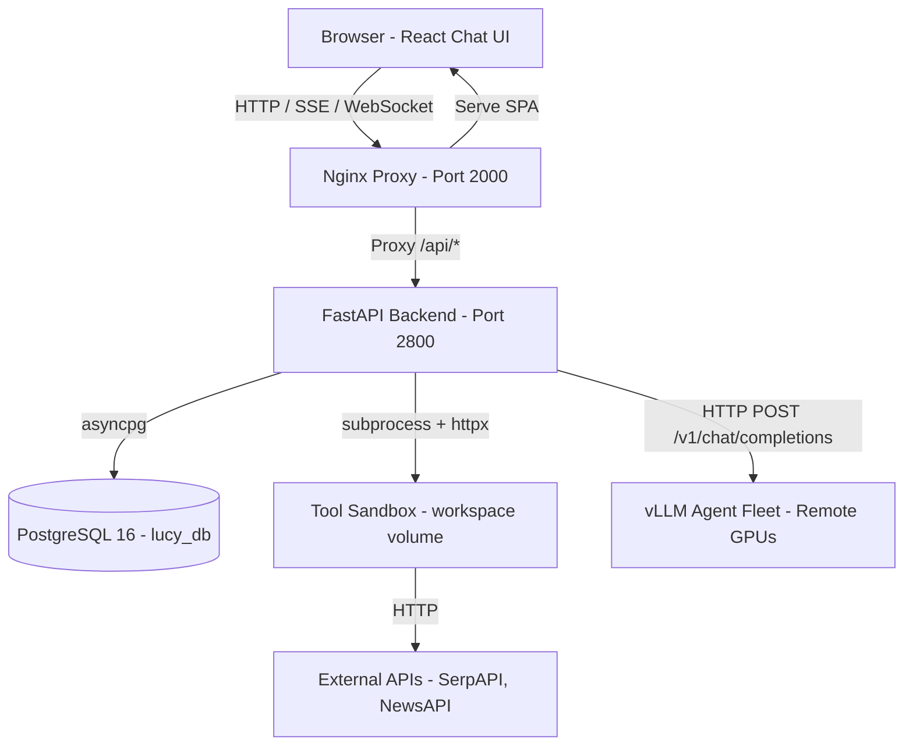
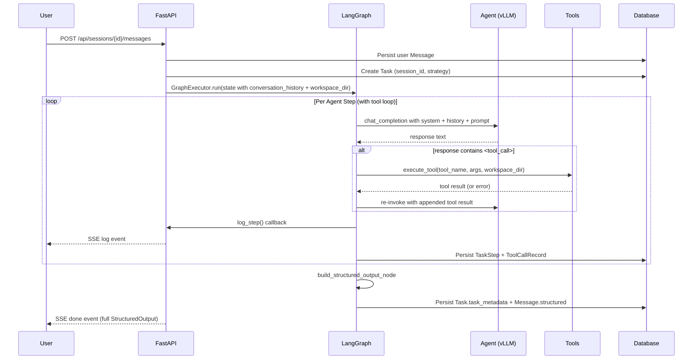

# Lucy: Architecture & Communication Summary

## 1. High-Level Architecture

Lucy is a conversational multi-agent orchestration platform. Users chat with sessions; the backend dispatches each message through a LangGraph strategy graph; agents use real tools (search, code execution, charts) and produce structured output rendered in the chat UI.



## 2. Technology Stack

- **Frontend:** React 18, TypeScript, Vite, TailwindCSS, shadcn/ui, react-markdown
- **Backend:** FastAPI, SQLAlchemy async, Pydantic v2
- **Database:** PostgreSQL 16
- **Orchestration:** LangGraph StateGraphs with MemorySaver checkpointing
- **Tools:** httpx (SerpAPI, NewsAPI), subprocess sandbox, matplotlib, pandas
- **LLM Protocol:** OpenAI-compatible `/v1/chat/completions`

## 3. Communication Protocols

### 3.1 REST API (HTTP)
Standard CRUD for sessions, agents, tasks, projects. Reverse-proxied through nginx (`/api/*` on port 2000 → FastAPI on port 8000).

### 3.2 Server-Sent Events (SSE) — Primary Streaming Channel
- **`POST /api/sessions/{id}/messages`** — Streams a chat message exchange. Three event types:
  - `log` — real-time orchestration progress (agent calls, tool invocations)
  - `heartbeat` — keep-alive
  - `done` — final `MessageResponse` with full `StructuredOutput`
- **`GET /api/tasks/{id}/events`** — task-scoped log stream + final done event

### 3.3 WebSocket
- `ws://host/api/ws/logs` — global log stream (all tasks, all sessions)
- `ws://host/api/ws/logs/{task_id}` — task-scoped log stream

### 3.4 Internal Backend Pub/Sub
`logger.py` implements an `asyncio.Queue` pub/sub. LangGraph nodes call `log_step()` which simultaneously writes to PostgreSQL and broadcasts to all subscribers (SSE clients + WebSocket clients).

### 3.5 Backend to Tools
- Web/News tools call external APIs via shared `httpx.AsyncClient`
- Code/Shell tools spawn subprocess sandboxes with timeouts
- File/Chart/CSV tools operate inside the session workspace (`/tmp/lucy-workspace/session_{id}/`)

### 3.6 Backend to vLLM
Shared pooled `httpx.AsyncClient` (created in lifespan). Context-window-aware input truncation. 120s default timeout.

## 4. Orchestration Flow



## 5. Data Layout

```
sessions  ──(1:N)──▶  messages  ──(1:N)──▶  tool_calls
   │                      │
   └──(1:N)──▶  tasks  ◀──┘
                  │
                  ├──(1:N)──▶  task_steps  ──(N:1)──▶  agents
                  │
                  └──(1:N)──▶  log_entries
```

## 6. Frontend Real-time Handling

The Chat page (`src/pages/Chat.tsx`) consumes the SSE stream from `POST /api/sessions/{id}/messages`:

1. Optimistically renders the user message + a typing indicator
2. Reads the SSE stream chunk-by-chunk
3. `log` events update a live progress feed below the typing indicator
4. `done` event triggers a query invalidation → React Query refetches the session → final structured message renders via `StructuredOutputRenderer`

This means users see live agent activity (tool calls firing, agents responding) while the orchestration is still in progress.
