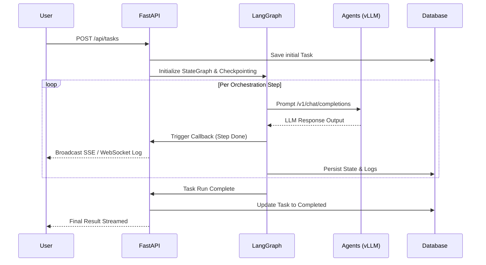

# Lucy: Architecture & Communication Summary

This document outlines the architecture and communication flow of the Lucy platform based on its repository structure and logic.

## 1. High-Level Architecture

Lucy is a real-time orchestration platform designed to manage and coordinate multiple LLM agents across a network of GPU servers.

```mermaid
flowchart TD
    Client[Browser (React + Vite)]
    Nginx[Nginx Proxy\nPort: 2000]
    API[FastAPI Backend\nPort: 2800]
    DB[(PostgreSQL 16\nPort: 2543\n lucy_db)]
    vLLM[vLLM Agent Fleet\nRemote GPUs]

    Client -->|HTTP / WebSocket| Nginx
    Nginx -->|Proxy /api/*| API
    Nginx -->|Serve SPA| Client
    API -->|asyncpg| DB
    API -->|HTTP POST /v1/chat/completions| vLLM
```

## 2. Technology Stack

- **Frontend:** React 18, TypeScript, Vite, TailwindCSS, shadcn/ui.
- **Backend:** FastAPI, SQLAlchemy (async), Pydantic v2.
- **Database:** PostgreSQL 16.
- **Orchestration:** LangGraph (StateGraph, conditional edges, MemorySaver).
- **LLM Protocol:** Standard OpenAI-compatible API.

## 3. Communication Protocols

Lucy relies on a combination of HTTP, Server-Sent Events, and WebSockets to handle real-time orchestration gracefully.

### 3.1 REST API (HTTP)
Standard HTTP communication handles CRUD operations (managing Agents, starting Tasks, and fetching History).
- **Frontend to Backend:** API calls are reverse-proxied by Nginx (`/api/*` on port 2000) to the FastAPI server (port 2800).
- **Backend to Agents:** FastAPI orchestrates remote vLLM/Ollama agents using standard HTTP POST requests to their OpenAI-compatible `/v1/chat/completions` endpoints.
- **Agent Self-Registration:** External agents can register themselves dynamically via `POST /api/agents/register` and must send periodic heartbeats to `/api/agents/heartbeat`.

### 3.2 Real-time Streaming (SSE & WebSockets)
To provide real-time streaming updates during long-running LangGraph executions.
- **Server-Sent Events (SSE):** The frontend connects to `GET /api/tasks/{id}/events`. The backend continuously streams execution states (`data: {...}`) and a completion signal (`data: {"type": "done"}`) as agents complete steps.
- **WebSockets:** 
  - `ws://host/api/ws/logs` — Subscribes to a global stream of all internal log entries.
  - `ws://host/api/ws/logs/{task_id}` — Subscribes to task-scoped logs.
- **HTTP Polling (Fallback):** The UI Monitor page can also poll `GET /api/logs?limit=200` to retrieve the latest logs.

### 3.3 Internal Backend Pub/Sub
- **Log Broadcaster:** Inside FastAPI, logs are broadcast using an `asyncio.Queue` based pub/sub mechanism (`logger.py`). When LangGraph nodes yield results, callbacks publish logs to the queue, immediately broadcasting them to active WebSocket and SSE subscribers.

## 4. Orchestration Flow

The backend handles complex sequences using **LangGraph StateGraphs**. Requests are mapped into execution graphs based on the strategy requested (e.g., Sequential, Parallel, Council, Hierarchical).


