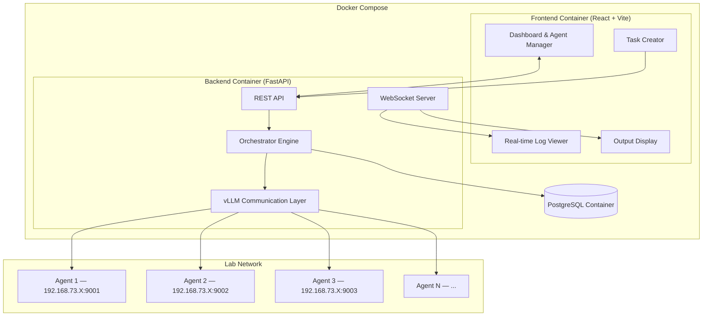

# Lucy — Multi-Agent Orchestration Platform

A platform to connect, manage, and orchestrate multiple LLM models running on lab systems via vLLM, with a central orchestrator agent (Lucy) coordinating everything.

## Architecture Overview



## Proposed Changes

### Project Structure

```
/home/lebi/projects/lucy/
├── docker-compose.yml            # Orchestrates all services
├── .env                          # Shared env vars (DB creds, ports)
├── backend/
│   ├── Dockerfile                # Python 3.12 + FastAPI
│   ├── app/
│   │   ├── main.py               # FastAPI app + CORS + WebSocket
│   │   ├── config.py             # Settings (DB URL, etc.)
│   │   ├── database.py           # SQLAlchemy async engine + session
│   │   ├── models.py             # DB models (Agent, Task, TaskStep, Log)
│   │   ├── schemas.py            # Pydantic schemas
│   │   ├── routers/
│   │   │   ├── agents.py         # Agent CRUD + health check
│   │   │   ├── tasks.py          # Task creation + execution
│   │   │   └── ws.py             # WebSocket for real-time logs
│   │   ├── services/
│   │   │   ├── llm_client.py     # OpenAI-compatible vLLM client
│   │   │   ├── orchestrator.py   # Core orchestration logic
│   │   │   └── logger.py         # Log broadcasting service
│   │   └── utils.py
│   ├── alembic/                  # DB migrations
│   ├── alembic.ini
│   └── requirements.txt
├── frontend/
│   ├── Dockerfile                # Node 20 + Vite build + Nginx
│   ├── nginx.conf                # Nginx config with API proxy
│   ├── src/
│   │   ├── App.jsx
│   │   ├── main.jsx
│   │   ├── index.css
│   │   ├── components/
│   │   │   ├── Layout.jsx        # App shell with sidebar
│   │   │   ├── AgentManager.jsx  # Add/edit/remove agents
│   │   │   ├── AgentCard.jsx     # Individual agent display
│   │   │   ├── TaskCreator.jsx   # Prompt input + strategy picker
│   │   │   ├── LogViewer.jsx     # Real-time log stream
│   │   │   ├── OutputPanel.jsx   # Final aggregated output
│   │   │   └── Dashboard.jsx     # Overview + agent health
│   │   ├── hooks/
│   │   │   ├── useWebSocket.js   # WebSocket connection hook
│   │   │   └── useApi.js         # API call utilities
│   │   └── styles/
│   │       └── theme.css         # Design tokens
│   ├── package.json
│   └── vite.config.js
└── README.md
```

---

### Backend — Database Models

#### [NEW] [models.py](file:///home/lebi/projects/lucy/backend/app/models.py)

| Model | Purpose | Key Fields |
|-------|---------|------------|
| **Agent** | Registered LLM endpoints | `id`, `name`, `endpoint` (e.g. `http://192.168.73.41:9002`), `model_name`, `role`, `description`, `is_active`, `created_at` |
| **Task** | Orchestration job | `id`, `prompt`, `strategy` (sequential/parallel/dynamic), `status`, `final_output`, `created_at`, `completed_at` |
| **TaskStep** | Individual agent call within a task | `id`, `task_id`, `agent_id`, `step_order`, `input_prompt`, `response`, `duration_ms`, `status`, `created_at` |
| **LogEntry** | Broadcast-able log records | `id`, `task_id`, `level`, `source`, `message`, `timestamp` |

---

### Backend — Agent Registry API

#### [NEW] [agents.py](file:///home/lebi/projects/lucy/backend/app/routers/agents.py)

- `POST /api/agents` — Register a new agent (name, endpoint, model, role)
- `GET /api/agents` — List all agents
- `GET /api/agents/{id}` — Get agent details
- `PUT /api/agents/{id}` — Update agent config/role
- `DELETE /api/agents/{id}` — Remove agent
- `GET /api/agents/{id}/health` — Ping the agent's vLLM endpoint to check availability
- `GET /api/agents/health` — Health check all agents in parallel

---

### Backend — vLLM Communication Layer

#### [NEW] [llm_client.py](file:///home/lebi/projects/lucy/backend/app/services/llm_client.py)

Uses `httpx.AsyncClient` to call each agent's OpenAI-compatible API:

```python
# Calls POST {agent.endpoint}/v1/chat/completions
async def chat_completion(agent: Agent, messages: list, **kwargs) -> str
```

- Handles timeouts, retries, error reporting
- Streams or non-streams responses
- Reports duration for performance tracking

---

### Backend — Orchestrator Engine

#### [NEW] [orchestrator.py](file:///home/lebi/projects/lucy/backend/app/services/orchestrator.py)

The core of Lucy. Three strategies:

| Strategy | How it works |
|----------|-------------|
| **Sequential** | Sends prompt to Agent 1 → takes response → sends (original prompt + Agent 1 response) to Agent 2 → ... → final agent produces output |
| **Parallel** | Sends the same prompt to ALL agents simultaneously → collects all responses → uses a designated "judge" agent to synthesize/pick the best |
| **Dynamic** | Sends the prompt to Lucy (the admin agent) first → Lucy analyzes the query and decides which agent(s) to route to and in what order → executes that plan |

- Each step creates a `TaskStep` record and broadcasts a `LogEntry` via WebSocket
- Final output is stored in `Task.final_output`

---

### Backend — WebSocket & Real-time Logs

#### [NEW] [ws.py](file:///home/lebi/projects/lucy/backend/app/routers/ws.py)

- `WS /api/ws/logs/{task_id}` — Stream logs for a specific task
- `WS /api/ws/logs` — Stream all logs globally
- Uses an in-memory pub/sub (asyncio Queue) for broadcasting

---

### Frontend — Admin Panel

#### [NEW] [Dashboard.jsx](file:///home/lebi/projects/lucy/frontend/src/components/Dashboard.jsx)
- Overview: total agents, active tasks, system health
- Agent status cards (green/red indicators for online/offline)

#### [NEW] [AgentManager.jsx](file:///home/lebi/projects/lucy/frontend/src/components/AgentManager.jsx)
- Add agent form: name, endpoint URL, model name, role (custom text), description
- Edit/delete existing agents
- Health check button per agent

#### [NEW] [TaskCreator.jsx](file:///home/lebi/projects/lucy/frontend/src/components/TaskCreator.jsx)
- Text area for prompt input
- Strategy selector dropdown (Sequential / Parallel / Dynamic)
- Agent selection (which agents to include, or "all")
- "Execute" button

#### [NEW] [LogViewer.jsx](file:///home/lebi/projects/lucy/frontend/src/components/LogViewer.jsx)
- Real-time scrolling log panel connected via WebSocket
- Color-coded by log level and agent source
- Timestamps and agent identification

#### [NEW] [OutputPanel.jsx](file:///home/lebi/projects/lucy/frontend/src/components/OutputPanel.jsx)
- Displays final aggregated output from task execution
- Shows individual agent responses in collapsible sections
- Markdown rendering for formatted outputs

---

### Docker & Compose

#### [NEW] [docker-compose.yml](file:///home/lebi/projects/lucy/docker-compose.yml)

Three services orchestrated together:

| Service | Image | Ports | Details |
|---------|-------|-------|---------|
| **db** | `postgres:16-alpine` | `5432` (internal) | Persistent volume, health check |
| **backend** | Custom (Python 3.12) | `8000:8000` | Hot-reload in dev, depends on db |
| **frontend** | Custom (Node 20 → Nginx) | `3000:80` | Nginx proxies `/api` → backend |

- `network_mode: bridge` so backend can reach lab systems on `192.168.73.x`
- Named volume `lucy_pgdata` for database persistence
- `.env` file for all config (DB creds, ports)

#### [NEW] [backend/Dockerfile](file:///home/lebi/projects/lucy/backend/Dockerfile)
```dockerfile
FROM python:3.12-slim
WORKDIR /app
COPY requirements.txt .
RUN pip install --no-cache-dir -r requirements.txt
COPY . .
CMD ["uvicorn", "app.main:app", "--host", "0.0.0.0", "--port", "8000", "--reload"]
```

#### [NEW] [frontend/Dockerfile](file:///home/lebi/projects/lucy/frontend/Dockerfile)
Multi-stage build: Node 20 builds the React app → Nginx serves static files and proxies API.

#### [NEW] [.env](file:///home/lebi/projects/lucy/.env)
```env
POSTGRES_USER=lucy
POSTGRES_PASSWORD=lucy_secret
POSTGRES_DB=lucy_db
DATABASE_URL=postgresql+asyncpg://lucy:lucy_secret@db:5432/lucy_db
BACKEND_PORT=8000
FRONTEND_PORT=3000
```

---

## User Review Required

> [!IMPORTANT]
> **Admin Agent**: Should the "admin agent" (Lucy's brain for dynamic routing) be configurable from the panel? I'd recommend a toggle on each agent card: "Use as orchestrator brain."

> [!IMPORTANT]
> **Model Parameters**: Should the admin panel allow per-agent `temperature`, `max_tokens`, `top_p` config? I'd recommend yes.

---

## Verification Plan

### Automated Tests
1. **Backend API tests** — pytest with httpx test client:
   ```bash
   docker compose exec backend pytest tests/ -v
   ```

2. **Mock vLLM server** — A simple FastAPI mock for testing without real hardware:
   ```bash
   docker compose exec backend python tests/mock_vllm.py
   ```

### Manual Verification
1. **Start everything**: `docker compose up --build`
2. **Open admin panel**: `http://localhost:3000`
3. **In the admin panel**:
   - Add an agent pointing to a real vLLM endpoint (e.g. `http://192.168.73.41:9002`)
   - Check agent health (should show green)
   - Create a task with a prompt, select a strategy
   - Watch real-time logs appear in the log viewer
   - Verify final output displays correctly
4. **Teardown**: `docker compose down` (add `-v` to also remove DB data)
